  
  <!-- ═══════════════════════════════════════════════════════════════════════════ -->
  <!--  ANIMATED HEADER                                                          -->
  <!-- ═══════════════════════════════════════════════════════════════════════════ -->
  

  
  

 

   
   
  

  

 

  

  

 <table align="center" border="1" style="border-collapse:collapse; border-color:#00c1ff; border-radius:12px;">
<tr>
<td align="center" style="padding:20px; background-color:#0d1117;">

</td>
</tr>
</table>

    <!-- ═══════════════════════════════════════════════════════════════════════════ -->
<!-- 🖥️ TERMINAL INTRO SECTION                                                   -->
<!-- ═══════════════════════════════════════════════════════════════════════════ -->
  <!--move to the end -->

  <em>"I think you can improve on everything; you're never perfect."</em>

