<div align="center">
  
  <!-- ═══════════════════════════════════════════════════════════════════════════ -->
  <!--  ANIMATED HEADER                                                          -->
  <!-- ═══════════════════════════════════════════════════════════════════════════ -->
  
  
  
  <br/>
  <!-- ═══════════════════════════════════════════════════════════════════════════ -->
<!-- 🖥️ TERMINAL INTRO SECTION                                                   -->
<!-- ═══════════════════════════════════════════════════════════════════════════ -->

<div align="center">
  
</div>

<br/>


<br/>

<!-- ═══════════════════════════════════════════════════════════════════════════ -->
<!-- 👤 ABOUT ME SECTION                                                          -->
<!-- ═══════════════════════════════════════════════════════════════════════════ -->


<br/><br/>

<table>
<tr>
<td width="100%" valign="top">

```yaml
name: Nandhan KK 
located_in: India
current_status: Student & Self-Taught Developer
life_philosophy: "who cares?"
```
</tr>
</table>

<br/>


<br/>


<p align="center">
  
</p>


<p align="center">
  
  
</p>
<p align="center">
  
</p>


## Contribution Activity


<p align="center">
  
</p>


##  Contribution Snake

<p align="center">
  
</p>


<p align="center">
  
</p>


<p align="center">
  <em>"I think you can improve on everything; you're never perfect."</em>
</p>

